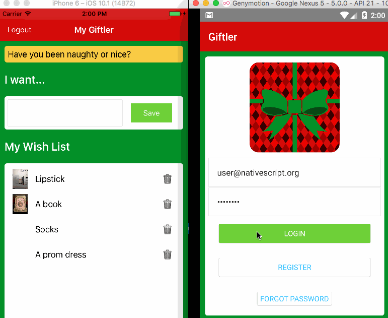

### SageNOTE
### Originally cloned from Giftler NS app - WORKING ON iPHONE (emulator not try ANDROID yet)
### Changed to my firebase.  Can create account, sign in, add image, add item, add descripton,
###     and remotely configure message.
###     I added a mapNow folder which now goes to new start screen coded in mapNow, no links for there work currently.  
###     Also got static 8 buttons in place (not connected to fxn), so select dropdown not right, need plugin
###   ABOVE IS DONE IN PREVIOUS VERSION 08
###   GIT pull down seemed broken, but my saved vesion 8 worked so Im started there, 
###         edited one button and saving as v11, saving to github.  
###   Version 9,10 will all be unfunctional
###   Added funcitonal click to moveALCreate in version12
###   In Version18 Group creation working to write - UID, group name, description, ~privacy, ~date.  Storing privacy 
###     but as any string and should be controlled dropdown or 0-1.  Date is a string and doesnt make sense so need to fix.  
###     Group component has 'id' which I can maybe drop.  Need to add a new page to add members to group, also view groups.
###   In Version21 - writing to User (cap U).  Also writing admin when creating a new group.  Also changed date to datInMilliseconds
###     and plan to have similar for user.  Hardcoded open into uesr group privacy, fix in spring. Add admin itoken as member, 
###     need to make array and include uesrId. TODO - for user I will have dobYYYY, dobMM, dobDD, and then concatenate them and use 
###     dateparse() maybe to also store dobInMilliseconds.  Currently hard sets admin
###     as current user, but should add (push?) current user to add to admins OR fail if group already exists probably.
###   In Version22 - added userId (in 'users' to match Firebase login ... but users has its own key which is different
###     likely change but will need FBservice addNewUser to change from push to set
###        https://firebase.google.com/docs/database/admin/save-data    
### NEXT STEPS
###   1.06) Add sidedrawer (now free) - Join, Create --> Group, Game, Goal 
###          https://www.nativescript.org/blog/using-cross-platform-native-sidedrawer-component-in-nativescript
###   1.07) Create --> Groups --> view current groups, make new group
###   1.6)- MAKE LOGIN GO TO "HELLO WORLD FROM SAGE" PAGE
###        1a) > ADD GOOGLE MAP TO THAT PAGE
###        > ADD BUTTON TO RECORD MOVEMENT EVERY 5 SECONDS
###   2) Add geofire , record geolocation
###   3)- BARCODE LOGIN
###
###   - ADD 3HASH IN TOP LEFT
###       maybe use "nativescript-angular-drawer-template" 
###         https://www.npmjs.com/package/nativescript-angular-drawer-template
###   4)     > CREATE - GROUP , GAME
###            * GAME THAT DELAYS START FROM HISTORICAL AVG TIME
###   5) Attendance view for group (first list, then on map by color)
###   6)     > JOIN GROUP
###        > GO
###        > DASHBOARDS
###            * PERSONAL HISTORY - MILES/TIME (LINE)
###            * A vs B (Bargraph over time, dropdown A ann B can be self or group you are a member of)
###        > SETTINGS
###        > HELP
###   -
###   -
###   -
###   -

# Giftler - Make managing holiday wish lists super easy!

This codebase is a demo to show how to use Angular 2 with NativeScript and Firebase to create a mobile app for holiday wish-list management.

- Using the Firebase Authentication module, register, log in, and manage your password.
- Using the Firebase Realtime Database, manage data flow (create, edit, and delete).
- Using Firebase's Remote Config service, send messages to your app
- Using the Storage Bucket that comes with your Firebase account, save photos of your gifts!

Read the article, forthcoming on various blogs <TBD>

